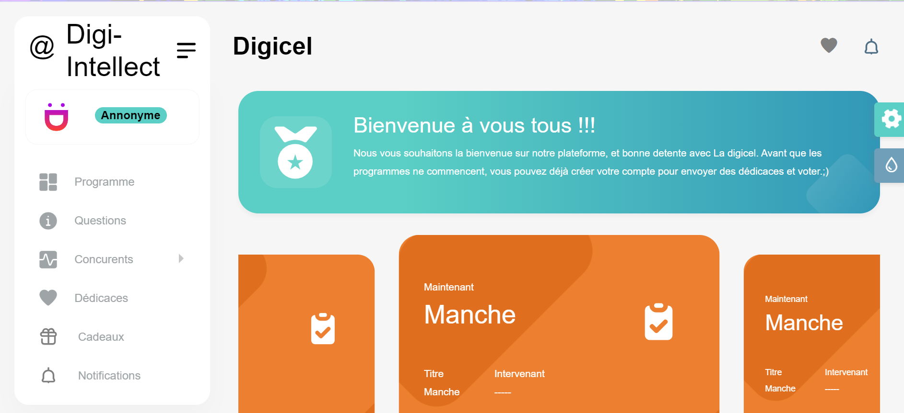
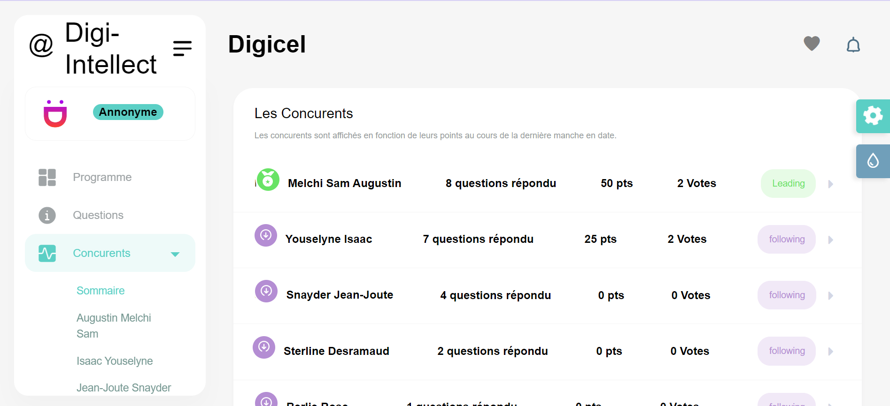
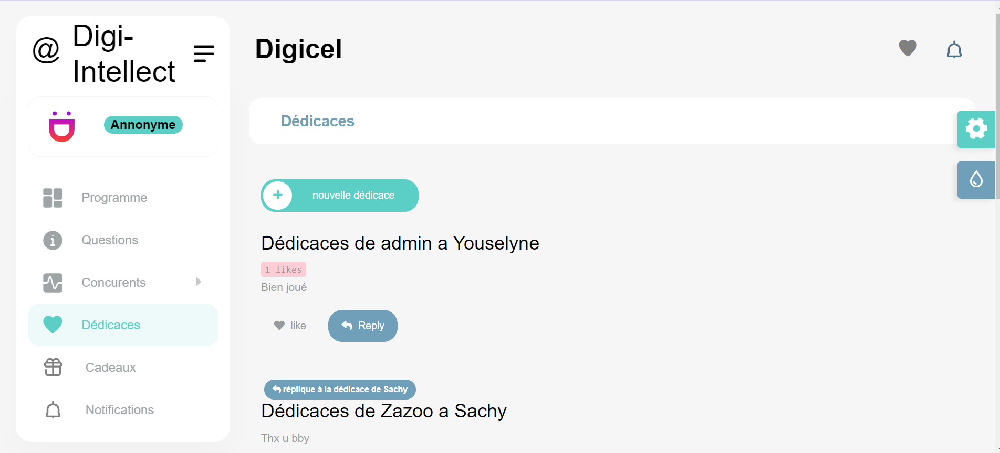

---

# Interactive Intellectual Competition Platform

Welcome to the **Interactive Intellectual Competition Platform**, an open-source project built with Django. This web application enables users to vote for competitors and follow their progress in real-time. The site provides an intuitive and engaging experience for both participants and spectators, featuring a voting system, real-time leaderboard, user profile management, and robust security measures.

## Screenshots









## Features

### 1. **User Registration and Profile Management**
- Participants can sign up by providing relevant information and create a personalized profile displaying their achievements and skills.
- Competitors can edit their profiles, track their voting history, and access badges or rewards earned throughout the competition.

### 2. **Voting System**
- Registered users can vote for their favorite competitors.
- Real-time vote updates keep the competition dynamic and engaging, fostering a competitive atmosphere.

### 3. **Real-time Leaderboard**
- The platform displays a leaderboard that updates in real-time, allowing participants to see their ranking in the competition.
- This feature motivates competitors to improve and excel as they can track their performance compared to others.

### 4. **Security**
- Strong security measures are implemented to protect user data and ensure the integrity of the competition.
- Mechanisms are in place to prevent manipulation of results and safeguard the confidentiality of participants' information.

## Installation

To set up the project locally, follow these steps:

### 1. Clone the repository:
```bash
git clone https://github.com/your-username/competition-platform.git
```

### 2. Create a virtual environment and activate it:
```bash
python3 -m venv venv
source venv/bin/activate  # On Windows, use `venv\Scripts\activate`
```

### 3. Install the dependencies:
```bash
pip install -r requirements.txt
```

### 4. Apply migrations:
```bash
python manage.py migrate
```

### 5. Run the development server:
```bash
python manage.py runserver
```

You can now access the site at `http://127.0.0.1:8000/` in your browser.

## Contributions

This project is open-source and welcomes contributions! Feel free to fork the repository, submit issues, or create pull requests. Any enhancements, bug fixes, or suggestions for new features are appreciated.

## License

This project is licensed under the MIT License. See the [LICENSE](LICENSE) file for more details.

## Contact

For questions or feedback, please reach out via [email](mailto:jeanmaryisai@gmail.com) or connect with me on [LinkedIn](https://linkedin.com/in/jeanmaryisai).
